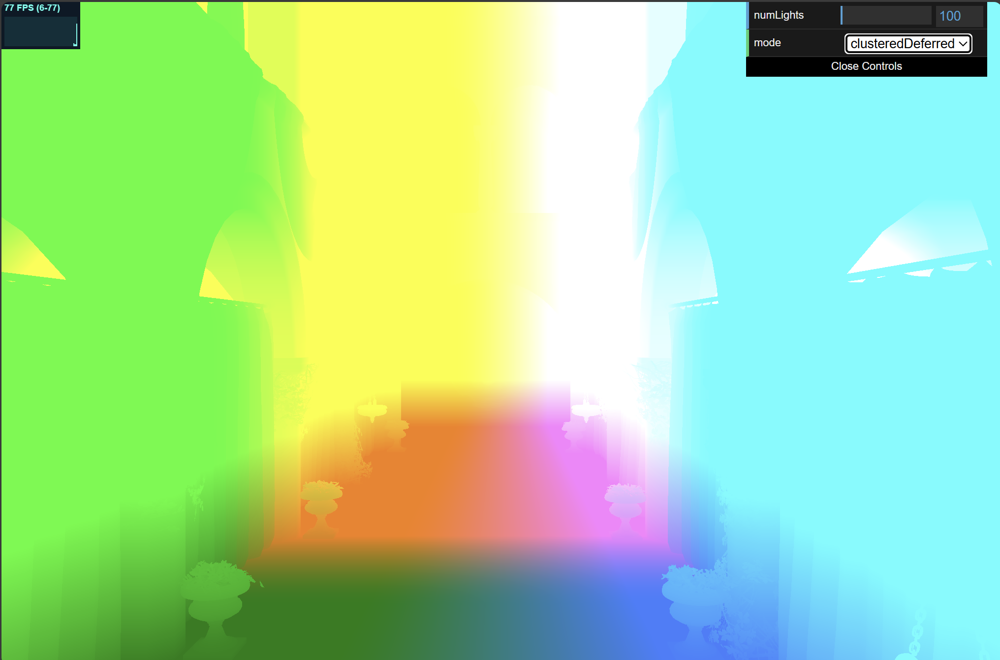
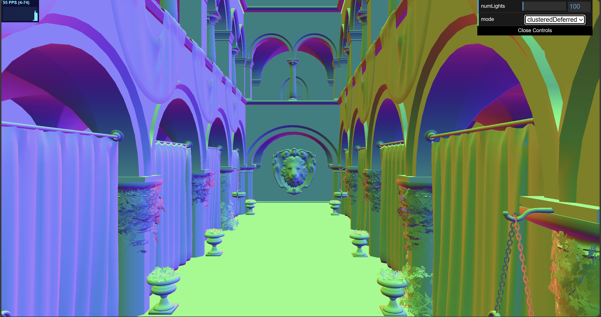
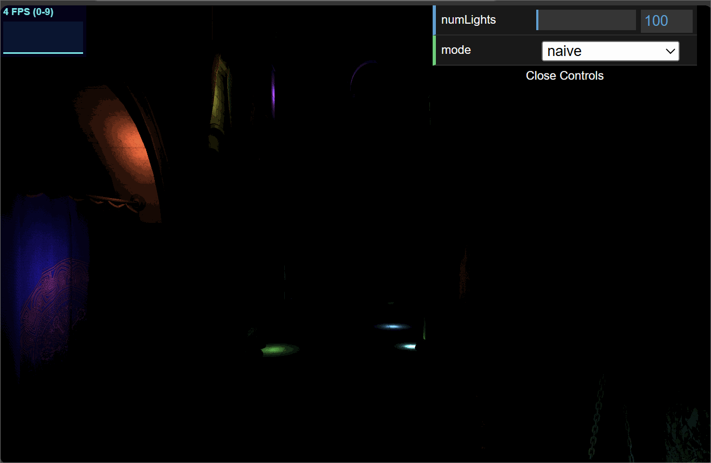
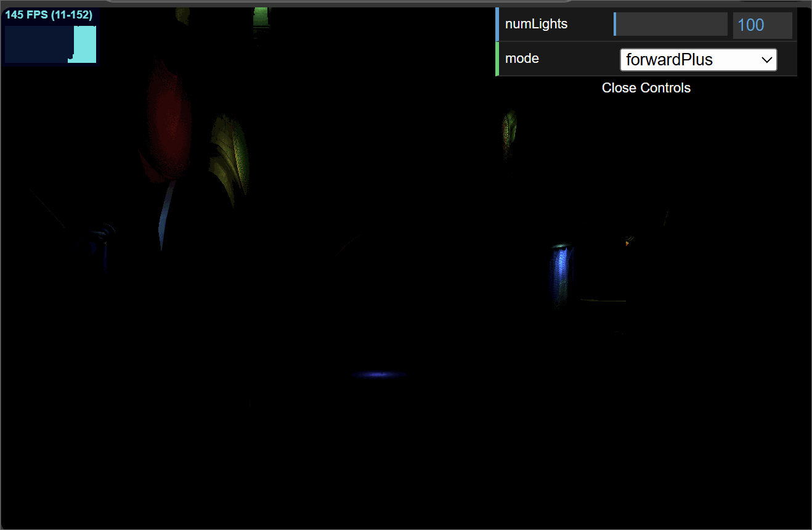
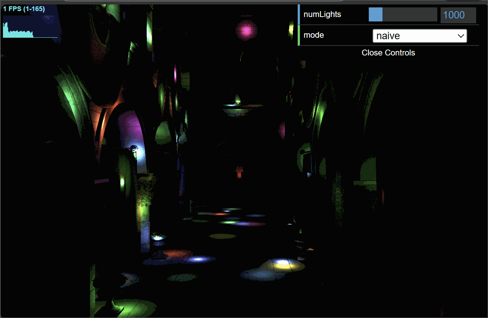
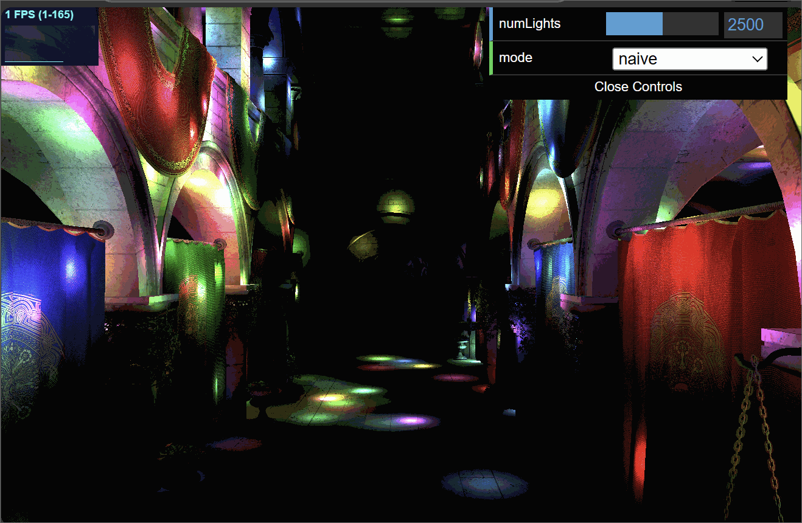
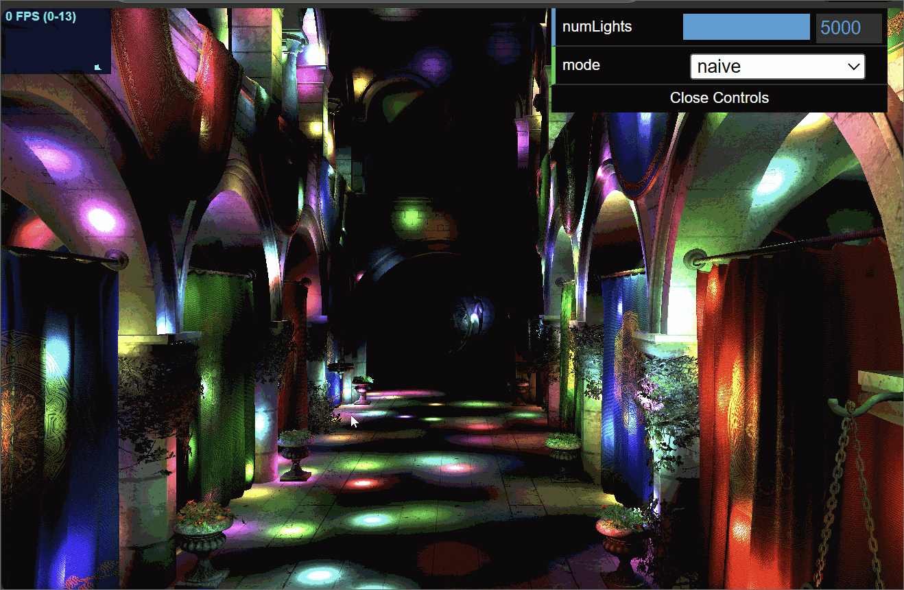
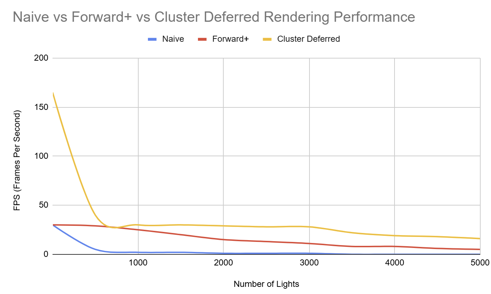

# University of Pennsylvania, CIS 5650: GPU Programming and Architecture
## Project 3 - WebGL Forward+ and Clustered Deferred Shading

* Zwe Tun
  * LinkedIn: https://www.linkedin.com/in/zwe-tun-6b7191256/
* Tested on: Intel(R) i7-14700HX, 2100 Mhz, RTX 5060 Laptop

---

## Overview  
This project explores three different implementations of real-time lighting in WebGPU.  
The rendered scene is the **Sponza Atrium** model, illuminated by a large number of **point lights**, with a **GUI** that allows switching between rendering modes.

- **Naive Shading**  
- **Forward+ Shading**  
- **Clustered Deferred Shading**  

---

### Implementation Summary  

- **Naive Shading:**  
  Uses a straightforward GPU-based approach where each fragment iterates through all lights in the scene to compute illumination.  
  This brute-force method becomes expensive as the number of lights increases due to its O(N×L) complexity (N = fragments, L = lights).

  **High-Level Steps:**  
  1. **Vertex Shader:** Transforms geometry into clip space.  
  2. **Fragment Shader:**  
     - For each pixel, iterate over every light in the scene.  
     - Compute light contributions  
     - Accumulate results and output the final color.  
  3. **Final Output:** Display the shaded image.  

- **Forward+ Shading:**  
  Divides the view frustum into 3D clusters and assigns lights to these clusters based on AABB (Axis-Aligned Bounding Box) intersection tests.  
  In the fragment shader, each pixel only considers lights within its cluster. This reduces insignificant light calculations by exploiting light attenuation. We are ignoring lights too far to meaningfully affect anything.

  **High-Level Steps:**  
  1. **Cluster Generation:**  
     - Subdivide the frustum into clusters
     - Compute the min/max depth per cluster.  
  2. **Light Assignment:**  
     - For each light, test which clusters it overlaps using AABB intersection.  
     - Store light indices per cluster in a GPU buffer.  
  3. **Rendering Pass:**  
     - Render geometry normally.  
     - In the fragment shader, determine the fragment’s cluster.  
     - Retrieve that cluster’s light list and compute lighting using only thoes lights.  
  4. **Final Output:** Display the shaded image.  

- **Clustered Deferred Shading:**  
  Extends the Forward+ approach by splitting lighting from geometry into two passes.  

  **High-Level Steps:**  
  1. **G-Buffer Pass:**  
     - Store material and geometric information (positions, normals, albedo) for each fragment.  
  2. **Light Clustering:**  
     - Perform same 3D cluster assignment as in Forward+.  
  3. **Lighting Pass:**  
     - For each screen pixel, determine cluster and retrieve lights.  
     - Compute lighting  using G-buffer data 
  4. **Final Output:** Display the shaded image.  

 ### Debugging via Fragment Shader Visualization  

To verify correctness during development, I used the fragment shader to visualize G-buffer outputs. By returning different texture samples from the shader, I could confirm that data written (such as world positions, normals, and albedo) aligned correctly.

- **World Position Visualization:**  

- **Normal Visualization:**  

- **Albedo Visualization:**  

---

### Comparison  

| Number of Lights | Naive Shading | Forward+ Shading | Clustered Deferred Shading |
|:--------:|:--------------:|:----------------:|:---------------------------:|
| **100**  |  |  |  |
| **1000** |  |  |  |
| **2500** |  |  |  |
| **5000** |  |  |  |

---

### Performance Analysis  

As we can see naive performs okay for small light counts at ~100 lights but scales poorly. Beyond 500 lights, the naive approach becomes bottlenecked by the loop that checks for every light in the scene. It's performance drops sharply as a result. Forward+ Shading provides a better performance boost by limiting light evaluations per cluster, resulting in greater frames than naive. Clustered Deferred Shading however sees the greatest improvement beating out both other implementations for all light numbers. The separation of geometry and lighting into two stages makes the differnce very apparant at 3000 lights we notice 28 FPS for Cluster Deferred, 11 FPS for Forward+ and only 1 FPS for naive. Lighting now scales with screen resolution rather than scene complexity. By avoiding redundant shading and vertex processing, Clustered Deferred remains the most efficient even with thousands of lights.

---

### Running the code
Follow these steps to install and view the project:

- Clone this repository
- Download and install Node.js
- Run npm install in the root directory of this project to download and install dependencies
- Run npm run dev, which will open the project in your browser

---

### Credits

- [Vite](https://vitejs.dev/)
- [loaders.gl](https://loaders.gl/)
- [dat.GUI](https://github.com/dataarts/dat.gui)
- [stats.js](https://github.com/mrdoob/stats.js)
- [wgpu-matrix](https://github.com/greggman/wgpu-matrix)
- [CIS 5650 Project 4 Recitation](https://docs.google.com/presentation/d/11T1bZ957AxEqSZMceZLIluE1KLHWXfCSI5heN5Y8g28/edit?slide=id.p#slide=id.p)
- [Based on Blog Psuedocode](https://www.aortiz.me/2018/12/21/CG.html#part-2)
- [CIS 5650 Slides](https://docs.google.com/presentation/d/1LJVo46C-LQcgaomN_EPBc33yc2ycXruN/edit?slide=id.p1#slide=id.p1)
